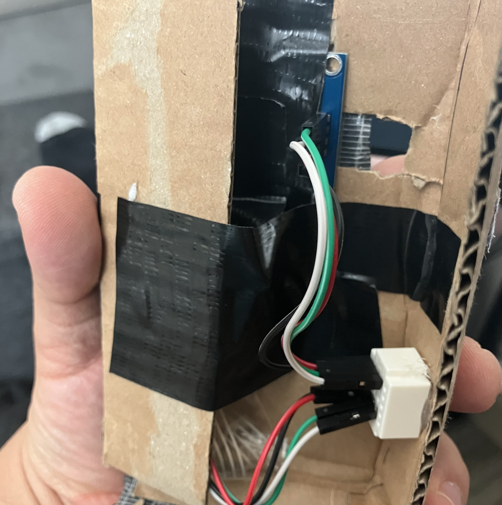
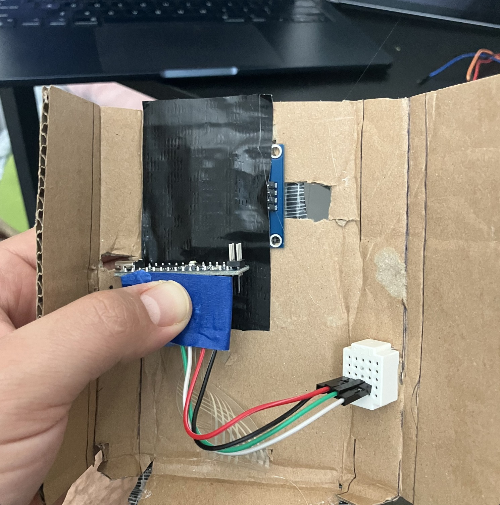

# Budget - Mini Fredgie Expenses Tracker

## Description
This project implements a **budget management system** based on Arduino, allowing users to input and track their expenses. It utilizes an OLED screen (SSD1306) and a matrix keypad for user interaction.

## Features
- **OLED Display (SSD1306)**: Displays the budget, the amount spent, and the available balance.
- **Matrix Keypad (4x4)**: Allows data entry for expenses or new budgets.
- **Dynamic Calculation**: Automatically updates the available balance based on entered expenses.
- **Expense Records**: Stores the last 5 entered expenses for quick reference.
- **Interactive Menu**: Includes options to review records and reset the budget.
- **Data Storage**: Allows addition or subtraction of values to the budget.

## Built With
- C++

### Hardware
- Arduino nano
- OLED Display (SSD1306)
- 4 x 4 Matrix Array Membrane

### Libraries
- U8g2lib
- Keypad
- RTClib

## Screenshots

<table>
  <tr>
    <td>
      
    </td>
    <td>
      
    </td>
  </tr>
  <tr>
    <td>
      
    </td>
    <td>
      
    </td>
  </tr>
</table>
